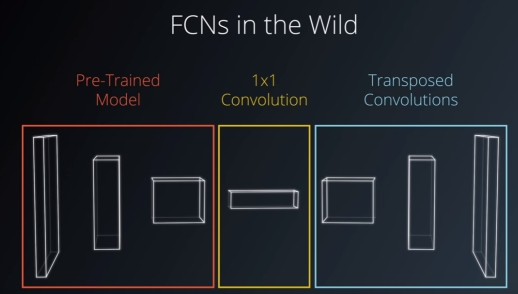
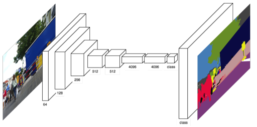
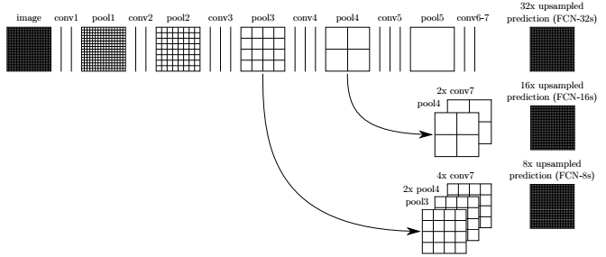
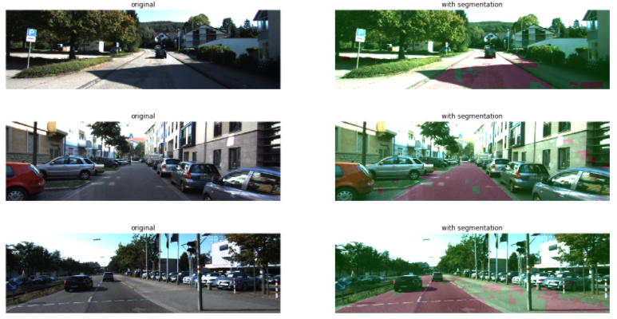

# FCN-Semantic-Segmentation-using-Pytorch-on-Kitti-Road-dataset

# Introduction

Semantic Segmentation is an image analysis task in which we classify each pixel in the image into a class. This is similar to what humans do whenever we are looking at something, we try to categorize what portion of the image belongs to which class/label. Humans would categorize larger shapes belonging to one class immediately without looking further at the details, but would look at it more closely in case the classification is not immediate. This approach mixes a global appreciation and a finer examination. This is what FCN models can do as well in the architecture described below.

The most common use cases for the Semantic Segmentation are:
- Autonomous Driving : Segmenting out objects like Cars, Pedestrians, Lanes and traffic signs so that the computer driving the car has a good understanding of the road scene in front of it.
- Facial Segmentation: Segmenting each part of the face into semantically similar regions – lips, eyes etc. This can be useful in many real-world applications. One application can be virtual make-over.
- Indoor Object Segmentation: Can be used combined with AR (Augmented Reality) and VR (Virtual Reality) and useful to architecture, interior design, furniture manufacture and retail shops.
- Geo Land Sensing: Geo Land Sensing is a way of categorising each pixel in satellite images into a category such that we can track the land cover of each area. So, it can be useful to prevent fires. Similarly, if ithere is heavy deforestation taking place n some area then appropriate measures can be taken. There can be many more applications using semantic segmentation on satellite images.

# Project description

In this project, we label the pixels of a road in images using a Fully Convolutional Network (FCN). FCN models differ from traditional model because it excludes any fully-connected layer and instead rely completely on convolution and transposed operation. Removing all fully-connected layers aims to preserve spatial information and obtain a pixel-wise prediction, ie a classification of each pixel from the original image.

I use a Semantic Segmentation FCN network adapted from the following [paper](https://arxiv.org/abs/1411.4038) 2015, Jonathan Long et al. The FCN introduced by the authors learns to combine coarse, high layer information with fine, low layer information, nobably by using "skip connections". 

A FCN model architecture comprises :
- an encoder, usually a pre-trained proven network with the dense, fully-connected, classification section removed. As such the encoder acts as a feature extractor using convolutional layers only, and preserving spatial information (which is lost using dense layers). The obtained features are passed through a decoder. It is common to use a 1x1 conv layer in-between to adjust the feature volume depth.
- a decoder which upsamples the extracted information back to the original image size. This can be achieved using transpose convolutional layers preserving spatial information as well. The output is a "grid" volume of size identical to the original image and of depth equals to the number of classes. Each pixel is therefore associated with a probability vector which allows to predict its class. 

In variant architecture, the decoder can simply be one transpose convolutional layer upsampling the feature volume coming out of the encoder directly to the size of the original image with a depth equals to the number of classes. This one single step acts as a pixel-wise classifier where the array on each pixel represents a likelihood distribution that the pixel belongs to each class. More information can be found in this paper [Street View Segmentation using FCN models](http://cs231n.stanford.edu/reports/2017/pdfs/633.pdf).

- skip connections are intermediate outputs of the encoder fed directly into the decoder at various stages in the upsampling process. In the paper "Fully Convolutional Networks for Semantic Segmentation", the authors used a pre-trained VGG16 for the encoder and extracted the outputs of maxpooling layers n°3 and n°4 (output of layer blocks 3 and 4) to feed the decoder along the upsampling process. The output of layer 7 (last maxpooling layer in VGG network) is pushed through a 1x1 convolutional layer and fed as input to the decoder.

This architecture's principles are summarized in the sketch below: The pooling and prediction layers are shown as grid that reveal relative spatial coarseness, while intermediate layers are shown as vertical lines. The VGG network portion is the horizontal part while the vertical section indicated the skip connections fed into the decoder.

On that basis, the authors refer to FCN-8, FCN-16 and FCN-32. The 32 indicates that in the pipeline it performs five max-pooling to reduce the size of image by 1/32. FCN-32 corresponds to all five maxpooling layers of the VGG16 network, FCN-16 only the first four and FCN-8 only the first three. Skip connections inject the output of each of these during the upsampling process. FCN-8 is upsampled 8 times back to the original dimensions while FCN-32 (the output of the VGG encoder) is upsampled by the decoder 32 times back to the original dimensions. This illustrates the combination of a range of information, from coarse to finer details, mentionned earlier. FCN-32 architecture is very efficient to process but can result in losing fine-grained features.

# Model architecture

My model :
- The encoder: I used VGG16 model pretrained on ImageNet for classification (see VGG16 architecture below). The fully-connected layers are removed. I did not use a 1-by-1 convolution to inject FCN-32 but directly connected the output to the first deconvolution layer of the decoder. I used two skip connections corresponding to FCN-8 and FCN-16: The outputs of the encoder Maxpooling layers are fed to 1x1 convolutions reducing the depth to match the decoder upsampling flow at the insertion point.

- The decoder: Transposed convolutions are used to upsample the input back to the original image size. Total upsampling is x32 using 5 deconvolution layers. Skip connections bridging the encoder to the decoder are used in the model. BatchNorm is used on the skip connection addition step while BatchNorm and ReLu is applied to the outputs of the transpose convolutions. The final layer is a AdaptiveMaxPooling3d (AMP) layer allowing to reduce the feature map from 16 to the number of classes which is 2, without changing the X-Y dimensions. This last layer acts as the classifier. AMP are convenient to perform final classification. 

Pretrained models expect a 3-channel image (RGB) which is normalized with the Imagenet mean and standard deviation, i.e., mean = [0.485, 0.456, 0.406], std = [0.229, 0.224, 0.225]. The input dimension is [N x C x H x W] where,

N -> the batch size
C -> the number of channels (which is 3)
H -> the height of the image
W -> the width of the image

The output dimension of the model is [N x C' x H x W] where,

N -> is the batch size
C' -> is the number of classes set for the classification task
H -> the height of the original image 
W -> the width of the original image 

The RGB images of the dataset are for the most part 375 x 1242. The model resizes these to 256 x 256 to reduce computation and manage the downsampling and upsampling without roundings. The same structure can operate on larger images (I also tested 352 x 1216). The output of the encoder is a feature volume of shape 8 x 8 x 512 (downsampling of 32x). This is passed through the first deConv layer which upsamples and reduce feature depth by 2. Throughout the decoder, the feature depth reduces towards `num_classes` while the network upsamples X and Y back to the original input image dimensions. The resulting final output is a volume of shape 256 x 256 x 2 providing a probability distribution for each pixel over the number of classes.

# Dataset

The model is trained in Pytorch using [KITTI Road dataset](http://www.cvlibs.net/datasets/kitti/eval_road.php) which can be downloaded [here](http://www.cvlibs.net/download.php?file=data_road.zip). The road and lane estimation benchmark consists of 289 training and 290 test images. Ground truth has been generated by manual annotation of the images and is available for two different road terrain types: road - the road area, i.e, the composition of all lanes, and lane - the ego-lane, i.e., the lane the vehicle is currently driving on (only available for category "um"). Ground truth is provided for training images only. For out purpose, we distinguish only two classes: road and non road (background).

## Results

I used batches of 32, BCELoss and Adam optimizer (lr=0.01). Best convergence results were achieved applying scaling factors to the two skip connections during the injection - addition step (x 0.01 for FCN-16 and x 0.0001 for FCN-8). The model has difficulties with shadow areas.

